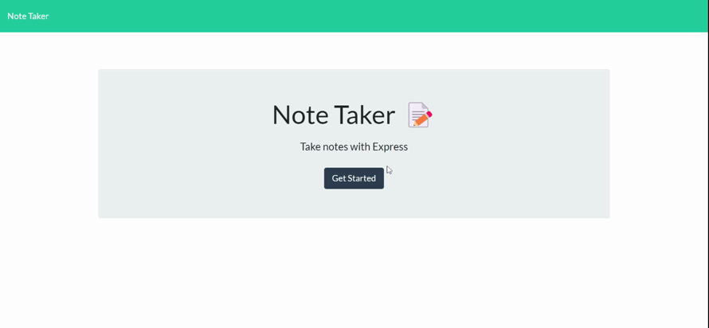

# Note Taker

For this challenge I was tasked with implementing the back end for a note taking app. The [starter code](https://github.com/coding-boot-camp/miniature-eureka) contained a public directory with html pages, a stylesheet, and a script.js file which made GET, POST, and DELETE requests to nonexistent API endpoints. I configured an Express server, served the html pages from their respective routes, and implemented the missing API routes.

### [Deployed Site](https://mr22-note-taker.herokuapp.com/) in use:



---

## User Story

```
AS A small business owner
I WANT to be able to write and save notes
SO THAT I can organize my thoughts and keep track of tasks I need to complete
```

## Acceptance Criteria

```
GIVEN a note-taking application
WHEN I open the Note Taker
THEN I am presented with a landing page with a link to a notes page
WHEN I click on the link to the notes page
THEN I am presented with a page with existing notes listed in the left-hand column, plus empty fields to enter a new note title and the note’s text in the right-hand column
WHEN I enter a new note title and the note’s text
THEN a Save icon appears in the navigation at the top of the page
WHEN I click on the Save icon
THEN the new note I have entered is saved and appears in the left-hand column with the other existing notes
WHEN I click on an existing note in the list in the left-hand column
THEN that note appears in the right-hand column
WHEN I click on the Write icon in the navigation at the top of the page
THEN I am presented with empty fields to enter a new note title and the note’s text in the right-hand column
```

## Technical Criteria

```
- Application front end must connext to an Express.js back end
- Application must store notes with unique IDs in a JSON file
- Application must be deployed to Heroku at a live URL
- Application loads with no errors
- Application console is free of errors
```

---

### Mockup Images:


